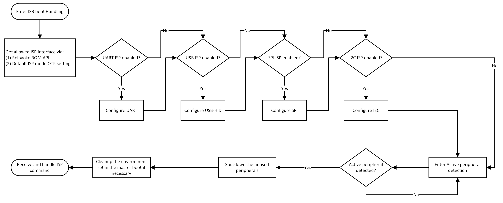
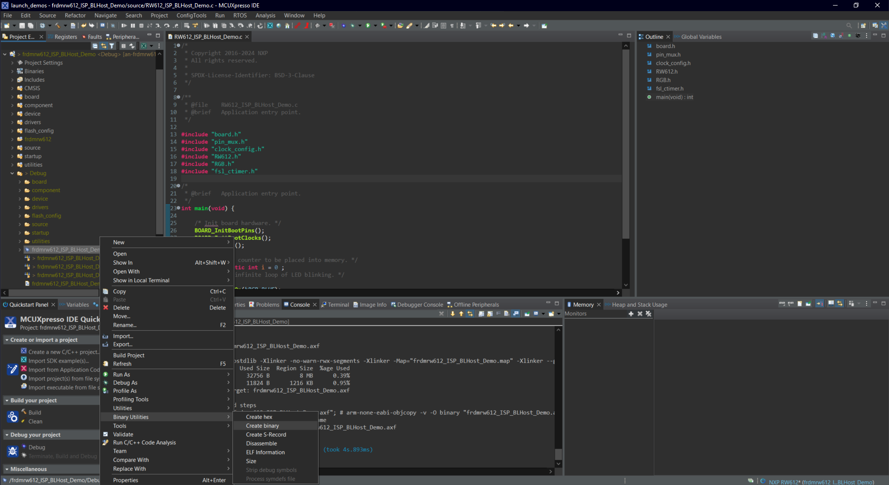
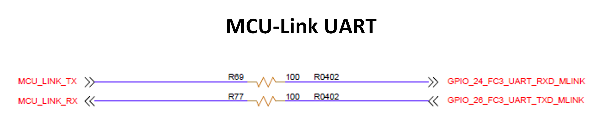
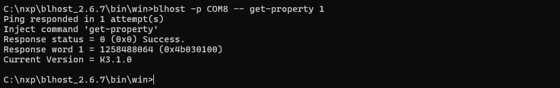
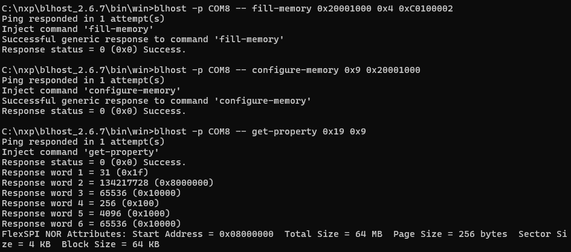
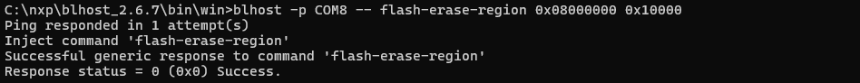
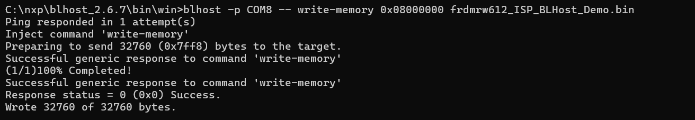

# NXP Application Code Hub
[](https://www.nxp.com)

## How to use In-System Programming (ISP) on FRDM-RW612
NXP RW612 microcontroller family is based on the ARM Cortex-M33 CPU architecture for embedded applications, offering an expanded scalability with breakthrough product capabilities, simplified system design and a developer-focuses through the widely adopted embedded programming tools.

The RW612 is a highly integrated, low-power tri-radio Wireless MCU family with an integrated MCU and 2.4 GHz Wi-Fi 6 + Bluetooth Low Energy (LE) / 802.15.4 radios designed for a broad array of applications, offering an expanded scalability with breakthrough product capabilities, simplified system design and a developer-focus through the widely adopted embedded programming tools.

The RW612 MCU subsystem includes a 260 MHz Arm® Cortex®-M33 core with TrustZone™-M, 1.2 MB on-chip SRAM. The RW612C also includes a Quad SPI interface with high bandwidth, and an on-the-fly decryption engine for securely accessing off-chip XIP flash and PSRAM.

Also, RW microcontroller enables In-System Programming capability (ISP) functions to load firmware to the MCU's external flash without the need of an external debugger/programmer.

#### Boards: FRDM-RW612
#### Categories: Tools
#### Peripherals: I2C, SPI, UART, USB
#### Toolchains: MCUXpresso IDE, VS Code

## Table of Contents
1. [ISP mode Overview](#step1)
2. [ISP mode & Supported pins on RW612](#step2)
3. [Creating a binary for ISP mode ](#step3)
4. [Get to know FRDM-RW612 ](#step4)
5. [BLHost](#step5)
6. [ISP over UART](#step6)
7. [ISP over USB](#step7)
8. [Loading application binary using ISP](#step8)
9. [Advanced Provisioning tools](#step9)
10. [Release Notes](#step10)

## 1. ISP mode Overview <a name="step1"></a>
The RW612 devices support UART, SPI, I2C and USB protocols to load firmware to the targeted RW612 device's external flash.

It is important to mention that ISP mode can be enabled by developers on an specific peripheral, disabling unused ones for security reasons. This is done by using the DEFAULT_ISP_MODE field in the BOOT_CFG[0] (fuseword 15) OTP register.

The ISP boot code is stored in internal ROM. After a MCU reset, the ROM code checks if there is a valid condition to enter ISP mode on the supported peripherals. The following diagram illustrates the flow of the ISP checking execution.

[](./Images/ISP-modeFlow.png)

Once the Microcontroller enters ISP mode it can auto-detect activity on these interfaces.

The auto-detect looks for activity on the listed interfaces and selects the appropriate one when a properly formed frame is received. In the case of an invalid frame, the data is discarded and scanning resumes. Communications for these interfaces are described in the RW612 User Manual's sub-chapters about In-System programming protocol and Bootloader packet types.

## 2. ISP mode & Supported pins on RW612 <a name="step2"></a>
The microcontroller will enter in ISP mode when:

  * **Blank device** – Microcontroller will enter automatically into ISP mode if the external flash is empty. No need to have an external signal to trigger ISP mode. This is very helpful for mass production process.
  * **Manually** – a logic value of 1110 [ISP3:ISP0] on the ISP pins during the MCU reset sequence.
  * **ROM API** - check ROM API and ISP chapters in the User Manual.

The Supported pins for each interface on RW family can be found in the following table:

| USB Full-Speed | UART              | I2C               | SPI                    | QSPI Flash Recovery    |
|:--------------:|:-----------------:|:-----------------:|:----------------------:|:----------------------:|
| USB0-DP        | GPIO_26 (FC3_TXD) | GPIO_17 (FC2_SDA) | GPIO_2 (FC0_SPI_SCK)   | GPIO_28 (FLEXSPI_SSEL) |
| USB0-DM        | GPIO_24 (FC3_RXD) | GPIO_16 (FC2_SCL) | GPIO_1 (FC0_SPI_SSEL1) | GPIO_34 (FLEXSPI_CLK)  |
| USB0_VBUS      |                   |                   | GPIO_3 (FC0_SPI_MISO)  | GPIO_29 (FLEXSPI_DQS)  |
|                |                   |                   | GPIO_26 (FC0_SPI_MOSI) | GPIO_30 (FLEXSPI_D0)   |
|                |                   |                   |                        | GPIO_31 (FLEXSPI_D1)   |
|                |                   |                   |                        | GPIO_32 (FLEXSPI_D2)   |
|                |                   |                   |                        | GPIO_33 (FLEXSPI_D3)   |

## 3. Creating a binary for ISP mode <a name="step3"></a>
There are some steps to create a .bin file. For this application note MCUXpresso and Visual Studio Code are covered and frdmrw612_ISP_BLHost_Demo example was selected but, the procedure with other firmware projects is the same:

The [frdmrw612_ISP_BLHost_Demo](frdmrw612_ISP_BLHost_Demo) project can be found on this repository. A pre-built binary file, [frdmrw612_ISP_BLHost_Demo.bin](frdmrw612_ISP_BLHost_Demo/binary/frdmrw612_ISP_BLHost_Demo.bin) can also be found with this application note.

#### MCUXpresso
  **1.** Open the example

  **2.** Build the project

  **3.** Go to folder Debug in Project Explorer

  **4.** Right click on frdmrw612_ISP_BLHost_Demo.axf

  **5.** Finally, search for Binary utilities and click on create a binary

[](./Images/FRDM-RW61x-binaryCreation.png)

## 4. Get to know FRDM-RW612<a name="step4"></a>
[FRDM-RW612](https://www.nxp.com/FRDM-RW612) board was designed to evaluate ISP mode using all supported interfaces.

[](./Images/FRDM-RW61x-Get2Know.png)

Here is a list of the location of the supported interfaces on the FRDM-RW612 for ISP evaluation:

| Peripheral     | Location                    |
|:--------------:|:---------------------------:|
| USB High-Speed | J8 Connector                |
| UART           | Over on board MCU-Link VCOM |

Please review the FRDM-RW612 schematic for detailed information on the location of all the interfaces signals. Be aware that some signals might need a resistor change.

## 5. BLHost <a name="step5"></a>
The blhost application is used on a host computer to issue commands to an NXP platform running an implementation of the MCU bootloader. The blhost application with the MCU bootloader, allows a user to program a firmware application onto the MCU device without a programming tool.

[blhost Manual](https://www.nxp.com/docs/en/user-guide/MCUBLHOSTUG.pdf)

[blhost Download](https://www.nxp.com/design/design-center/software/development-software/mcuxpresso-software-and-tools-/mcu-bootloader-for-nxp-microcontrollers:MCUBOOT)


## 6. ISP over UART<a name="step6"></a>
By default the supported UART ISP pins of the RW612 are enabled to the on board MCU-Link debugger interface.

[](./Images/FRDM-RW61x-VCOM.png)

To enter ISP mode on FRDM-RW612 board follow the next steps:

[](./Images/FRDM-RW61x-ISP-UART.png)

**1.** Connect a USB-C cable to the MCU-Link USB-C connector (J10) and connect the other side to the Computer.

**2.** Press and hold the ISP button (SW3)

**3.** Press and release Reset Button (SW1)

**4.** Release ISP Button (SW3)

Open blhost command line, write the following, but replace the COM port number with the one used by your own host computer. You can check COM port list on the Device Manager in Windows

```
blhost -p COMxx get-property 1
```
[](./Images/ISP-UART-get-property1.png)

Once this command is executed and response status is Success, now you can run other commands for RW612 using blhost application.

## 7. ISP over USB<a name="step7"></a>
In-System Programming over USB is implemented as a standard “Human Interface Device” or USB-HID device for large compatibility with different computer operating systems.

When transferring data through USB-HID device class, USB-HID does not use framing packets. Instead, the packetization, inherent in the USB protocol itself is used. The ability for the device to NAK out transfers (until they can be received) provides the required flow control. The built-in CRC of each USB packet provides the required error detection.

For more information about supported features for USB ISP programming please review the ISP section on the reference manual of the specific RW device you have.

To enter ISP mode on FRDM-RW612 board follow the next steps:

[](./Images/FRDM-RW61x-ISP-USB.png)

**1.** Connect a USB-C cable to the MCU-Link USB-C connector (J10) and connect the other side to the Computer.

**2.** Connect a USB-C cable to the High-Speed USB-C connector (J8) and connect the other side to the Computer.

**3.** Press and hold the ISP button (SW3)

**4.** Press and release Reset Button (SW1)

**5.** Release ISP Button (SW3)

Once the sequence was executed correctly a new USB-HID device was enumerated on the computer with VID: 0x1fc9 and PID: 0x0020.

MS Windows users can verify that a new USB device was enumerated in the device manager.

Using blhost command line, write the following line that includes 0x1fc9,0x0020 as USB Vendor ID and Product ID.

```
blhost -u 0x1fc9,0x0020 get-property 1
```

[](./Images/FRDM-RW61x-ISP-USB-getproperty.png)

By having response from last command, target device can be programmed, erased, read, etc. by using the blhost commands.

## 8. Loading application binary using ISP<a name="step8"></a>
Once the communication has been established (regardless of the serial peripheral used), the binary file is ready to be deployed. Erase the content on the flash and write the new binary following the next steps:

Note: blhost commands are shown using UART but the same commands apply using other ISP peripherals changing the communication part of the command accordingly.

**1. Configure the RW612's Flash driver**

Since RW612 external flash, in order to erase/write/read the external memory we need to configure the FlexSPI peripheral first.

Following commands have the Boot ROM generate a Flash configuration and then configure the Flash driver. Last command prints information about the flash driver's configuration.

```
blhost -p COMxx -- fill-memory 0x20001000 0x4 0xC0100002
blhost -p COMxx -- configure-memory 0x9 0x20001000
blhost -p COMxx -- get-property 0x19 0x9
```

[](./Images/FRDM-UART-configure-flash.png)

Also here is an example to list the memory regions available on the target and the external memories status:

```
blhost -p COMxx list-memory
```

[](./FRDM-UART-mem-list.png)

**2. Erase RW612 external Flash**

Let's erase just enough Flash to store the hello world binary built before.

```
blhost -p COMxx -- flash-erase-region 0x08000000 0x10000
```

[](./Images/FRDM-UART-flash-eraseRegion.png)


**3. Load binary on RW external Flash**

```
blhost -p COMxx -- write-memory 0x08000000 <<binary file>>
```

[](./Images/FRDM-UART-flash-writeMem.png)

Once the write process is complete you can simply press the reset button (SW1) or power-on your board again and your new firmware will be executed. With the frdmrw612_ISP_BLHost_Demo.bin file you shall see the RGB LED blinking blue.

## 9. Advanced Firmware Provisioning tools <a name="step9"></a>

The [MCUXpresso Secure Provisioning tool (SEC)](https://www.nxp.com/design/design-center/software/development-software/mcuxpresso-software-and-tools-/mcuxpresso-secure-provisioning-tool:MCUXPRESSO-SECURE-PROVISIONING) is a GUI-based application that provides some basic firmware provisioning operations such as setting up e-fuses/OTP, building secure boot image, flash programming, keys generation, trust provisioning, etc.

  * Easy-to-use configuration of secure provisioning project settings
  * Enables direct communication with attached device for provisioning and programming
  * Supports generation of executable scripts for production use
  *	Manufacturing mode for simplified production line use


The [Secure Provisioning SDK (SPSDK)](https://www.nxp.com/design/design-center/software/development-software/secure-provisioning-sdk-spsdk:SPSDKG) is an open-source development kit with its source code released on Github and PyPI. It contains a set of API modules for custom production tool development which requires more advanced secure provisioning flow. SPSDK enables connection and communication with NXP’s microcontrollers for the following purposes:

  * Generation of Secure Binary (SB) bootable images
  * Security features configuration (CMPA, CFPA, Trustzone, secure bootloader, debug authentication, etc.)
  * Generation and management of cryptographic keys and certificates
  * Trust provisioning and secure programming through MCU Bootloader
  * Debug authentication through J-Link, PEmicro and PyOCD debug probes
#### Project Metadata
<!----- Boards ----->
[](https://github.com/search?q=org%3Anxp-appcodehub+FRDM-RW612+in%3Areadme&type=Repositories)

<!----- Categories ----->
[](https://github.com/search?q=org%3Anxp-appcodehub+tools+in%3Areadme&type=Repositories)

<!----- Peripherals ----->
[](https://github.com/search?q=org%3Anxp-appcodehub+i2c+in%3Areadme&type=Repositories) [](https://github.com/search?q=org%3Anxp-appcodehub+spi+in%3Areadme&type=Repositories) [](https://github.com/search?q=org%3Anxp-appcodehub+uart+in%3Areadme&type=Repositories) [](https://github.com/search?q=org%3Anxp-appcodehub+usb+in%3Areadme&type=Repositories)

<!----- Toolchains ----->
[](https://github.com/search?q=org%3Anxp-appcodehub+mcux+in%3Areadme&type=Repositories) [](https://github.com/search?q=org%3Anxp-appcodehub+vscode+in%3Areadme&type=Repositories)

Questions regarding the content/correctness of this example can be entered as Issues within this GitHub repository.

>**Warning**: For more general technical questions regarding NXP Microcontrollers and the difference in expected funcionality, enter your questions on the [NXP Community Forum](https://community.nxp.com/)

[](https://www.youtube.com/@NXP_Semiconductors)
[](https://www.linkedin.com/company/nxp-semiconductors)
[](https://www.facebook.com/nxpsemi/)
[](https://twitter.com/NXP)

## 10. Release Notes<a name="step10"></a>
| Version | Description / Update                           | Date                        |
|:-------:|------------------------------------------------|----------------------------:|
| 1.0     | Initial release on Application Code Hub        | May 2<sup>nd</sup> 2024 |

<small>
<b>Trademarks and Service Marks</b>: There are a number of proprietary logos, service marks, trademarks, slogans and product designations ("Marks") found on this Site. By making the Marks available on this Site, NXP is not granting you a license to use them in any fashion. Access to this Site does not confer upon you any license to the Marks under any of NXP or any third party's intellectual property rights. While NXP encourages others to link to our URL, no NXP trademark or service mark may be used as a hyperlink without NXP’s prior written permission. The following Marks are the property of NXP. This list is not comprehensive; the absence of a Mark from the list does not constitute a waiver of intellectual property rights established by NXP in a Mark.
</small>
<br>
<small>
NXP, the NXP logo, NXP SECURE CONNECTIONS FOR A SMARTER WORLD, Airfast, Altivec, ByLink, CodeWarrior, ColdFire, ColdFire+, CoolFlux, CoolFlux DSP, DESFire, EdgeLock, EdgeScale, EdgeVerse, elQ, Embrace, Freescale, GreenChip, HITAG, ICODE and I-CODE, Immersiv3D, I2C-bus logo , JCOP, Kinetis, Layerscape, MagniV, Mantis, MCCI, MIFARE, MIFARE Classic, MIFARE FleX, MIFARE4Mobile, MIFARE Plus, MIFARE Ultralight, MiGLO, MOBILEGT, NTAG, PEG, Plus X, POR, PowerQUICC, Processor Expert, QorIQ, QorIQ Qonverge, RoadLink wordmark and logo, SafeAssure, SafeAssure logo , SmartLX, SmartMX, StarCore, Symphony, Tower, TriMedia, Trimension, UCODE, VortiQa, Vybrid are trademarks of NXP B.V. All other product or service names are the property of their respective owners. © 2021 NXP B.V.
</small>
